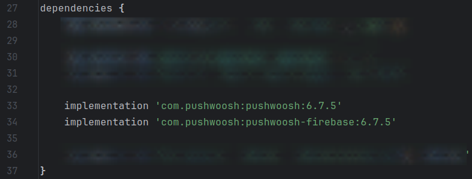
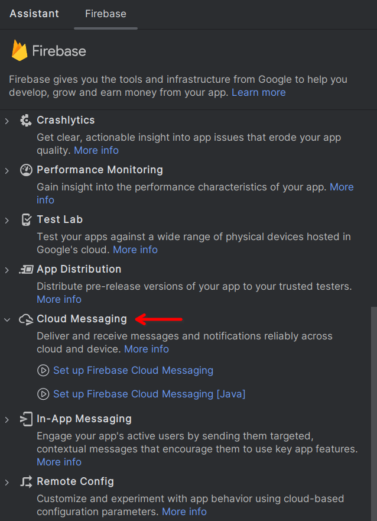
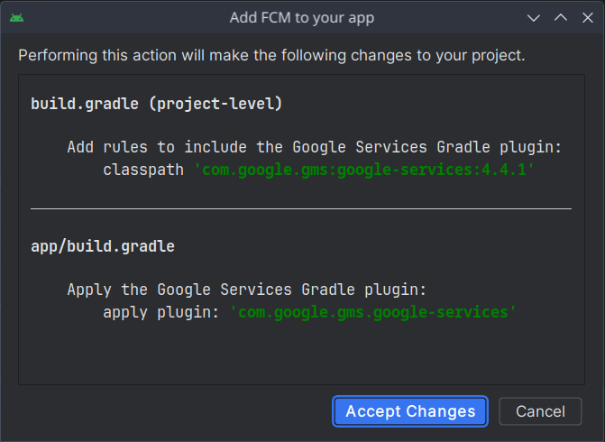
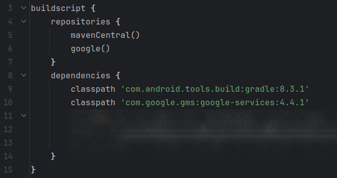
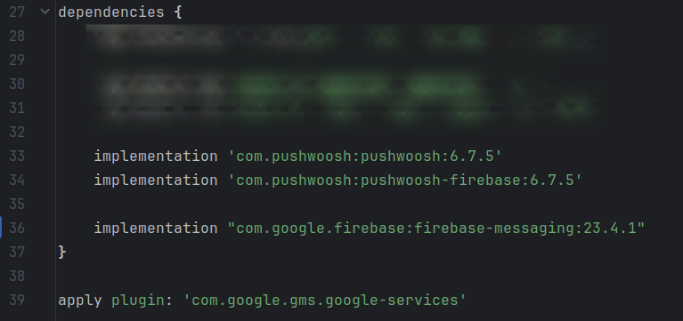
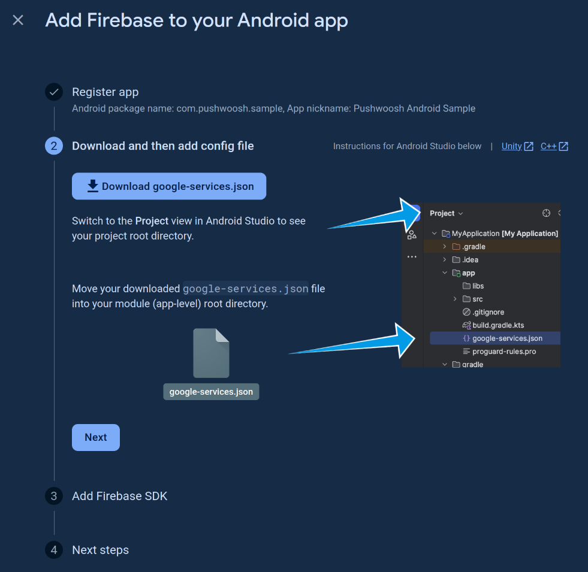
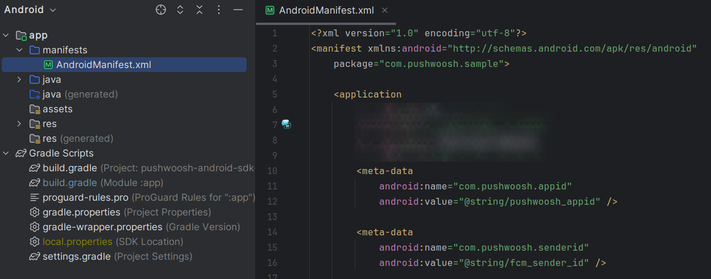
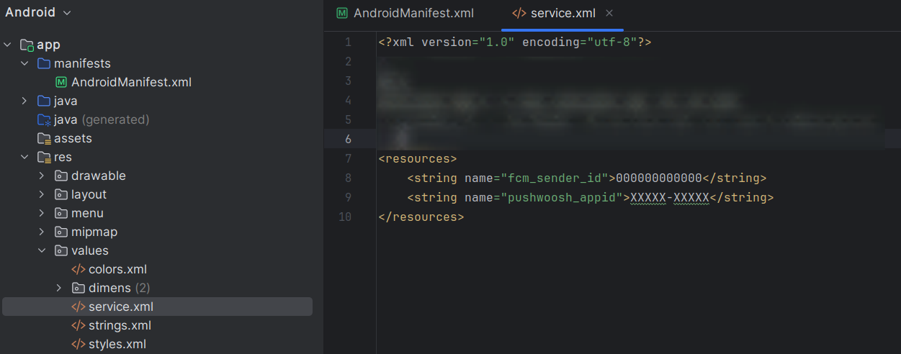

# Quickstart the sample

1. Clone the repo `git clone <URL>` or download it as a zip archive
2. Follow [Android Firebase configuration](https://docs.pushwoosh.com/platform-docs/first-steps/start-with-your-project/configure-project/configure-android-platform) guide to configure an Android app in Pushwoosh
3. Obtain a google-services.json file and your Sender ID from your Firebase project
4. Place your google-services.json file to the app/ directory
5. Change `fcm_sender_id` and `pushwoosh_appid` in the service.xml file (res/values/service.xml) with your IDs
6. Build the app
7. Run it

---

# Integrate Pushwoosh Android SDK

Follow the steps below to get your Android application ready to receive pushes.

> Watch [this video](https://www.youtube.com/watch?v=TUxcg73kAwQ) where our dedicated Customer Success team will guide you through the onboarding process at Pushwoosh, from setting up projects to sending your first communications.

* [**Download SDK**](https://github.com/Pushwoosh/pushwoosh-android-sdk/releases)
* [**Sample Project**](https://github.com/Pushwoosh/pushwoosh-android-sdk-sample)
* [**SDK API Docs**](https://github.com/Pushwoosh/pushwoosh-android-sdk/tree/master/Documentation)

## Requirements

* A [Pushwoosh account](https://sso.pushwoosh.com/login)
* A configured Pushwoosh Application's Code available in [Pushwoosh Control Panel](https://app.pushwoosh.com) in format **XXXXX-XXXXX**
* A [Firebase project](https://docs.pushwoosh.com/platform-docs/first-steps/start-with-your-project/configure-project/configure-android-platform), its Sender ID, config file (google-services.json) and private key
* [Android Studio](https://developer.android.com/studio)
* An Android device or emulator with "Google Play Store (Services)" installed

## Integration

### Add repositories and dependencies

1\. Include the following Maven repository URL in project's **build.gradle**:

```gradle
allprojects {
  repositories {
    google ()
    mavenCentral()
  }
}
```

2\. Add **pushwoosh** library dependencies into your application's **build.gradle**:

```gradle
implementation 'com.pushwoosh:pushwoosh:6.+'
implementation 'com.pushwoosh:pushwoosh-firebase:6.+'
```

*Replace "**+**" with the current version of [Pushwoosh Android SDK](https://github.com/Pushwoosh/pushwoosh-android-sdk/releases/latest) and Android Support libraries.*



### Add Firebase Cloud Messaging (FCM) service

#### Automatic configuration

1\. Open your project in Android Studio. Go to **Tools** → **Firebase** → **Cloud Messaging** and click "Set up Firebase Cloud Messaging":



2\. Connect your app with Firebase, grant Android Studio access to your Google account (if needed), and choose your Firebase project. Then add FCM to your application and accept changes:



#### Manual configuration

1\. Add the **google-services** classpath into your project's **build.gradle**:

```gradle
classpath 'com.google.gms:google-services:4.+'
```

*Replace "**+**" with the current version of [Google Services](https://mvnrepository.com/artifact/com.google.gms/google-services)*



2\. Add the **firebase** library dependency into your application's **build.gradle**. And apply the Google Services plugin:

```gradle
dependencies {
    <...>

    implementation 'com.pushwoosh:pushwoosh:6.+'
    implementation 'com.pushwoosh:pushwoosh-firebase:6.+'

    implementation "com.google.firebase:firebase-messaging:23.+"
}

apply plugin: 'com.google.gms.google-services'
```

*Replace "**+**" with the current version of [Firebase Messaging](https://mvnrepository.com/artifact/com.google.firebase/firebase-messaging) library.*



### Add the config file

Obtain your **google-services.json** file from your Firebase project and place it to the **app/** directory.



### Provide Pushwoosh and Firebase IDs

1\. Add the following metadata to **AndroidManifest.xml**:

```xml
<meta-data
	android:name="com.pushwoosh.appid"
	android:value="@string/pushwoosh_appid" />

<meta-data
	android:name="com.pushwoosh.senderid"
	android:value="@string/fcm_sender_id" />
```

Where:

* `com.pushwoosh.appid` is your Pushwoosh Application Code
* `com.pushwoosh.senderid` is the Sender ID you received from Firebase Console

*Note that you must add `<meta-data />` inside the `<application>` tag.*



2\. Next, specify these values to the **strings.xml** file (res/values/strings.xml) or move them to the separate **service.xml** file, as in the example.

```xml
<resources>
	<string name="pushwoosh_appid">XXXXX-XXXXX</string>
	<string name="fcm_sender_id">000000000000</string>
</resources>
```



### Register for notifications

Finally, register to receive push notifications.

Add the code below where you want to subscribe the user to notifications.

```java
Pushwoosh.getInstance().registerForPushNotifications()
```